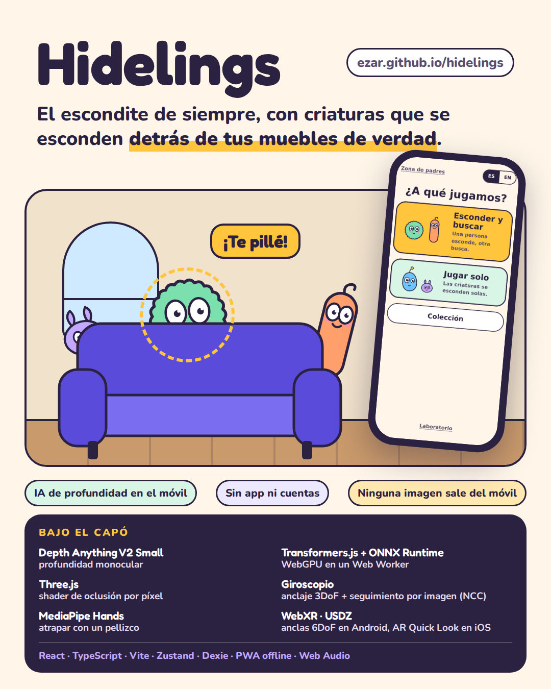

# Hidelings

Hide and seek with little creatures that hide behind the real things in your house. Point the phone around the room, spot one peeking out from behind the sofa, and catch it with a tap or a pinch. It runs in the phone's browser: no app to install, no accounts, and no image ever leaves the phone.

- **Play**: https://ezar.github.io/hidelings/
- **M0 proof of concept**: https://ezar.github.io/hidelings/poc/

<p align="center"></p>

## What you can do

- **Hide and seek (pass-and-play)**: one person hides the creatures behind the furniture, passes the phone behind a curtain screen, and another person looks for them. The game refuses a spot where a creature would show too much, and gives sound and arrow hints if the seeker gets stuck.
- **Play alone**: show the game the room by turning slowly around, and it hides the creatures itself. You can pick Easy, Normal or Hard. Depending on the difficulty, the creatures peek out less and move to other spots while you are not looking.
- **Six species**, each with its own habits:
  - Pompón peeks over edges.
  - Fideo hides behind legs and door frames.
  - Tímido pulls back if you stare.
  - Curioso creeps closer when you look away.
  - Dormilón sleeps in dark corners.
  - Brillo is rare and only comes out when the lights are off.
- **Collection**: a bestiary that fills up as you catch creatures. On iPhone, "Verlo en tu habitación" shows a caught creature in the room with AR Quick Look.
- **Grown-ups' area**, behind a hold-and-sum gate:
  - Round time, hint delay and a session limit with a break screen.
  - Sound, whether solo creatures move, and the room name.
  - Model storage, recalibration, and exporting, importing or deleting the collection.
- **Android with ARCore**: an augmented reality mode where creatures stay anchored to the room in 6DoF, so you can walk around them.
- Spanish and English. Portrait only. Works offline after the first visit.

## How it works

| Piece | Role |
| --- | --- |
| Depth Anything V2 Small | Monocular depth from the camera image: what is in front of what |
| Transformers.js + ONNX Runtime Web | Runs the model on WebGPU (WASM fallback) in a Web Worker |
| Three.js | Creatures in 3D and a per-pixel occlusion shader that hides them behind nearer surfaces |
| DeviceOrientation | 3DoF anchoring: creatures stay put as the phone turns |
| Image tracking (NCC) | Each creature follows the patch of image around its anchor, so it does not slide when you walk |
| MediaPipe Hands | Catch with a pinch in front of the camera |
| WebXR (Android) / USDZ (iOS) | 6DoF anchors with hit-test and depth sensing / AR Quick Look from the collection |
| React, TypeScript, Vite, Zustand, Dexie | UI, state, and the collection in IndexedDB |
| vite-plugin-pwa, Web Audio | Offline support; synthesized sounds, no audio files |

The primary target is iPhone Safari without WebXR. Every model and asset, with its license, is listed in [`docs/models.md`](docs/models.md). The project is MIT licensed.

## Status

Every milestone in the spec (M0 to M5) is built and deployed, and the unit tests and headless browser smoke tests pass. M0 and M1 were measured on an iPhone. M2 to M5 still need their device checks on the iPhone and on an Android phone with ARCore. See the status list in [`CLAUDE.md`](CLAUDE.md) and the decision records below.

## Docs

- [`docs/spec.md`](docs/spec.md): full specification and milestones.
- [`docs/decisions/`](docs/decisions/): decision records:
  - [0001](docs/decisions/0001-m0-results.md): M0 results.
  - [0002](docs/decisions/0002-m1-runtime.md): runtime.
  - [0003](docs/decisions/0003-m2-occlusion.md): occlusion.
  - [0004](docs/decisions/0004-m3-pass-and-play.md): pass-and-play.
  - [0005](docs/decisions/0005-m4-collection-parent-safety.md): collection, parent area and safety.
  - [0006](docs/decisions/0006-m4-solo.md): solo mode.
  - [0007](docs/decisions/0007-m5-parallax.md): parallax.
  - [0008](docs/decisions/0008-m5-platforms.md): WebXR and Quick Look.
- [`docs/design/`](docs/design/): design tokens, components, motion and the screen designs.
- [`docs/models.md`](docs/models.md): models and assets with their licenses.

## Develop

Node 22.

```sh
npm install
npm run dev        # http://localhost:5173/hidelings/
npm run check      # typecheck, lint and unit tests; run before every push
npm run build      # static site in dist/
```

URL flags:

- `?mock` uses a fake depth engine, so no model is downloaded (handy on a desktop or in browser tests).
- `?notrack` turns off anchor tracking, to compare against the gyroscope alone.

Camera and motion sensors need HTTPS on a phone. Every push to `main` runs CI and deploys `dist/` (with `poc/` copied in) to GitHub Pages.

## Layout

```
src/
  app/            shell, session start flow, stores, report
  engine/         species, game rules, the round and solo logic, without rendering or AI
  features/
    onboarding/   welcome, permissions, model download
    home/         main menu
    game/         hide, curtain, seek and results; the solo room scan
    xr/           Android WebXR mode
    collection/   bestiary, species cards, AR Quick Look
    parent/       grown-ups' gate and settings
    safety/       slow-down card and break screen
    calibration/  field-of-view calibration
    lab/          occlusion lab
    stage/        shared camera stage and depth loop
  perception/     depth (worker, engine, normalization, temporal blend), motion, spots, track, hands, probe
  render/         Three.js overlay, occlusion shader, creatures in 3D and 2D, USDZ export
  audio/          synthesized sounds
  data/           model cache and the collection (IndexedDB)
  i18n/           Spanish and English strings
poc/              M0 proof of concept, unchanged
docs/             spec, decisions, design, models, press image
```
